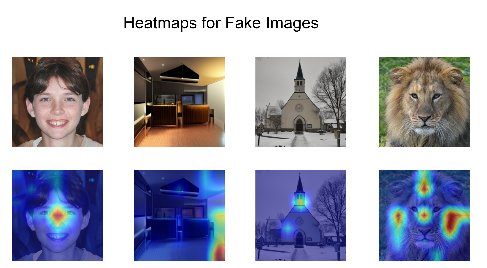
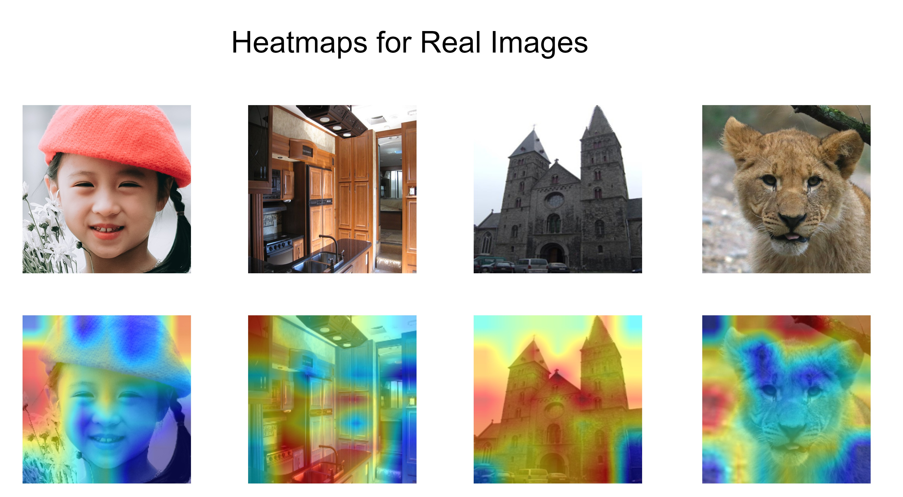

# SWINSight
A state of the art machine learning model that utilizes SWIN Transformer backbone for detection of artificially generated images.

# Overview

SWINSight takes in an image and outputs a prediction of whether the image is authentic or has been artificially generated. SWINSight also utilizes GradCAM for visualizing the areas of the image that the model takes into consideration while making its prediction.

# Getting Started
```
pip install requirements.txt
```

After running the above command, import the dataset by placing the images in the dataset folder. All artificially generated images should be placed in the fake_images folder while all authentic images have to be placed in real_images folder.

# Training and Evaluation

## Training the model
The training data for the model can be generated using any generator of choice along with the images from the dataset on which the generator is trained on.

```
python train.py
```

# GradCAM
<div style="display: flex;">
  
  
</div>
</br>

# Citation
This paper is currently under review.

# License
This work is licensed under the Apache-2.0 license.